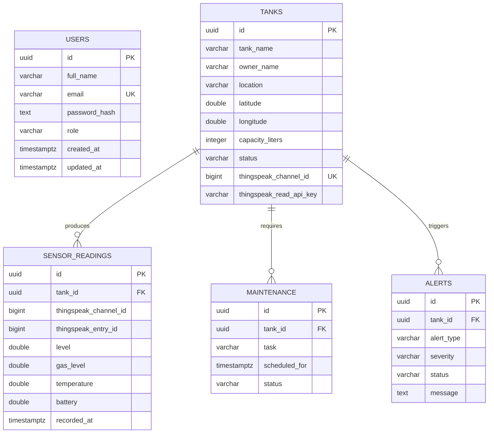

# SSMEAS Final ER Diagram

```mermaid
erDiagram
    USERS {
        uuid id PK
        varchar full_name
        varchar email UK
        text password_hash
        varchar role
        timestamptz created_at
        timestamptz updated_at
    }
    TANKS {
        uuid id PK
        varchar tank_name
        varchar owner_name
        varchar location
        double latitude
        double longitude
        integer capacity_liters
        varchar status
        bigint thingspeak_channel_id UK
        varchar thingspeak_read_api_key
    }
    SENSOR_READINGS {
        uuid id PK
        uuid tank_id FK
        bigint thingspeak_channel_id
        bigint thingspeak_entry_id
        double level
        double gas_level
        double temperature
        double battery
        timestamptz recorded_at
    }
    MAINTENANCE {
        uuid id PK
        uuid tank_id FK
        varchar task
        timestamptz scheduled_for
        varchar status
    }
    ALERTS {
        uuid id PK
        uuid tank_id FK
        varchar alert_type
        varchar severity
        varchar status
        text message
    }
    TANKS ||--o{ SENSOR_READINGS : produces
    TANKS ||--o{ MAINTENANCE : requires
    TANKS ||--o{ ALERTS : triggers
```

Users are authorization principals and intentionally have no ownership relationship to operational records. Tank deletion is restricted while dependent records exist.
